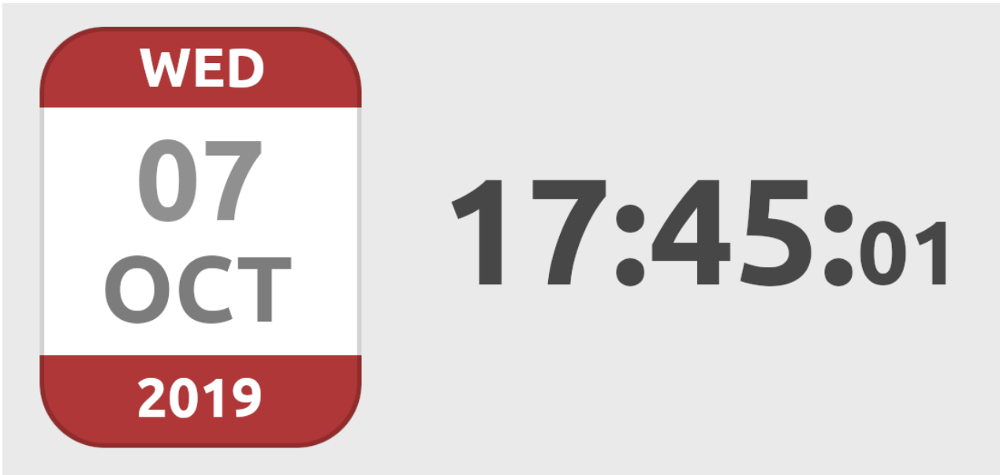

# ⏱️ DIGITAL CLOCK 
This project is a simple digital clock horizontally and vertically centered on the page, providing a clean an simple interface.

## 🚀 Features  
- Displays today's date based on the user's **timezone**.
- Shows the current time (hours, minutes, seconds), updating every second in **real-time**.
- Toggle between **12-hour** and **24-hour** formats by clicking on the hour section of the clock.

## 🛠️ Technologies Used
- HTML
- CSS
- JavaScript
  
## 🎯 Model  
